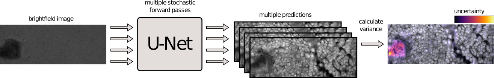

# BFNet

Visualising uncertainty in brightfield to fluorescent image inference.


**NOTE: work in progress**




## Installation
```bash
git clone https://github.com/swarchal/bfnet
cd bfnet
python setup.py install
```

## Usage

### Training

```bash
python train.py --help
```

```
usage: 
BFNet, a bayesiallen approximation for uncertainty measures in
brightfield to fluorescence image inference.

       [-h] [--train_csv TRAIN_CSV] [--validation_csv VALIDATION_CSV]
       [--image_dir IMAGE_DIR] [--output_path OUTPUT_PATH]
       [--n_epochs N_EPOCHS] [--lr LR] [--batch_size BATCH_SIZE]
       [-t N_FORWARD_PASSES] [-p PROP_DROPOUT] [--model_name MODEL_NAME]

optional arguments:
  -h, --help            show this help message and exit
  --train_csv TRAIN_CSV
                        path to csv file containing training image paths
  --validation_csv VALIDATION_CSV
                        path to csv file containing validation image paths
  --image_dir IMAGE_DIR
                        directory containing images, this will be appended to
                        the paths in the data csv
  --output_path OUTPUT_PATH
                        directory in which to store the results
  --n_epochs N_EPOCHS   number of training epochs
  --lr LR               learning rate for optimiser
  --batch_size BATCH_SIZE
                        batch size
  -t N_FORWARD_PASSES, --n_forward_passes N_FORWARD_PASSES
                        number of forward passes for stochastic MC dropout
                        during inference
  -p PROP_DROPOUT, --prop_dropout PROP_DROPOUT
                        proportion of dropout to apply during inference
  --model_name MODEL_NAME
                        what to call the model weights saved in --output_path

```

### Inference
```bash
python test.py --help
```

```
usage: Use a trained F-Net model on a dataset in csv form to make predictions
       [-h] [-w WEIGHT_PATH] [-d DATASET] [-o OUTPUT_DIR] [-t FORWARD_PASSES]
       [-p P_DROPOUT]

optional arguments:
  -h, --help            show this help message and exit
  -w WEIGHT_PATH, --weight_path WEIGHT_PATH
                        Path to the trained model weights (state_dict).
  -d DATASET, --dataset DATASET
                        Path to dataset csv file.
  -o OUTPUT_DIR, --output_dir OUTPUT_DIR
                        Path to directory in which to save the images.
  -t FORWARD_PASSES, --forward_passes FORWARD_PASSES
                        Number of forward passes for MC dropout variance
                        calculation.
  -p P_DROPOUT, --p_dropout P_DROPOUT
                        Proportion of dropout in MC dropout variance
                        calculation.

```


## Citation
[BioRxiv pre-print](https://www.biorxiv.org/content/10.1101/2020.03.13.987420v1?rss=1)
